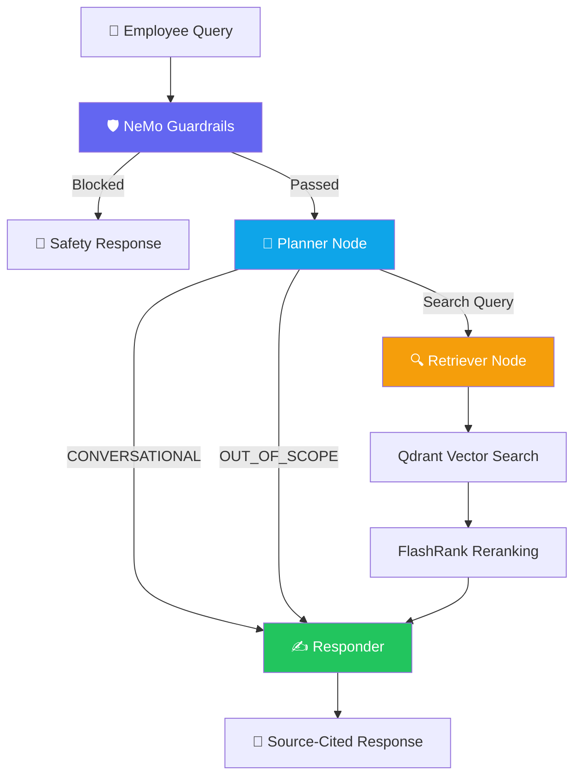

# 🏢 NovaTech KnowledgeHub

> **Your company's brain, instantly searchable** — an AI-powered internal knowledge base built with an agentic RAG pipeline, enterprise guardrails, and production-grade observability.

[](https://python.org)
[](https://fastapi.tiangolo.com)
[](https://langchain-ai.github.io/langgraph/)
[](Dockerfile)
[](LICENSE)

---

## 🎯 The Problem

Employees waste **1.8 hours per day** searching for internal information across scattered documents, wikis, Slack threads, and outdated PDFs. New hires take weeks to find basic answers about policies and processes.

## 💡 The Solution

**NovaTech KnowledgeHub** lets any company upload their internal documentation and instantly get an AI assistant that employees can query in natural language — with source-cited, accurate answers in seconds.

Built as a **production-grade platform** with:

- 🧠 **Agentic RAG** — not a simple chatbot, but an intelligent multi-step pipeline that plans, retrieves, reranks, and synthesizes
- 🛡️ **Enterprise Guardrails** — NeMo Guardrails for jailbreak prevention, off-topic filtering, and output safety
- 🔍 **Hybrid Retrieval** — vector search + cross-encoder reranking for precision
- 💬 **Conversational Memory** — thread-based memory so the assistant remembers context across turns
- 📡 **Full Observability** — distributed tracing across every pipeline stage

---

## ✨ Key Features

| Feature                          | Details                                                                                                        |
| -------------------------------- | -------------------------------------------------------------------------------------------------------------- |
| **Agentic RAG Pipeline**   | LangGraph state machine: Planner → Retriever → Responder with conditional routing                            |
| **Enterprise Guardrails**  | NVIDIA NeMo Guardrails — jailbreak detection, prompt injection prevention, off-topic filtering, output safety |
| **Conversational Memory**  | Thread-based memory via`MemorySaver` — the assistant remembers past turns                                   |
| **Semantic Reranking**     | FlashRank cross-encoder (ONNX-optimized) re-scores retrieved chunks for precision                              |
| **Multi-Format Ingestion** | Supports PDF, HTML, DOCX, PPTX, and TXT out of the box                                                         |
| **Vector Search**          | Qdrant Cloud with 3072-dim Gemini embeddings and cosine similarity                                             |
| **Distributed Tracing**    | End-to-end observability with Pydantic Logfire across UI, backend, and guardrails                              |
| **Streaming Chat UI**      | Streamlit dashboard with real-time streaming, reasoning visibility, and source citations                       |
| **Docker Ready**           | Multi-stage Dockerfile + Docker Compose for one-command deployment                                             |

---

## 🏗️ Architecture



### Agent Workflow

1. **🛡️ Guardrails Gate** — NeMo Guardrails evaluates every query for jailbreak attempts, prompt injection, and off-topic content. Blocked queries get a safe response without hitting the RAG pipeline.
2. **🧠 Planner Node** — An LLM classifies user intent: `CONVERSATIONAL` (use memory), `OUT_OF_SCOPE` (redirect), or generates a refined search query.
3. **🔍 Retriever Node** — Embeds the query with Gemini, searches Qdrant for top 15 candidates, then **reranks** with FlashRank's cross-encoder to keep the top 5 most relevant chunks.
4. **✍️ Responder Node** — Synthesizes a grounded answer using retrieved context + full conversation history, with mandatory source citations.

---

## 🛠️ Tech Stack

| Layer                         | Technology                                                   |
| ----------------------------- | ------------------------------------------------------------ |
| **API Framework**       | FastAPI + Uvicorn                                            |
| **Agent Orchestration** | LangGraph (StateGraph)                                       |
| **LLM**                 | Llama 3.3 70B via Groq                                       |
| **Embeddings**          | Gemini Embedding 2 Preview (3072-dim)                        |
| **Vector Database**     | Qdrant Cloud (Cosine similarity)                             |
| **Reranking**           | FlashRank (ms-marco-MiniLM-L-6-v2, local ONNX)               |
| **Guardrails**          | NVIDIA NeMo Guardrails (jailbreak, off-topic, output safety) |
| **Document Parsing**    | pypdf, pdfplumber, BeautifulSoup4, python-docx, python-pptx  |
| **Frontend**            | Streamlit                                                    |
| **Observability**       | Pydantic Logfire + Loguru                                    |
| **Containerization**    | Docker + Docker Compose                                      |

---

## 📁 Project Structure

```
knowledgehub/
├── app/
│   ├── main.py                          # FastAPI app — API endpoints + guardrails integration
│   ├── config.py                        # Settings & environment variables
│   ├── agents/
│   │   ├── graph.py                     # LangGraph workflow definition + memory
│   │   ├── state.py                     # AgentState TypedDict
│   │   └── nodes/
│   │       ├── planner.py               # Intent classification (CONVERSATIONAL/OUT_OF_SCOPE/search)
│   │       ├── retriever.py             # Vector search + FlashRank reranking
│   │       └── responder.py             # LLM response synthesis with source citations
│   ├── guardrails/
│   │   ├── __init__.py                  # Guardrails module (initialize_rails, guard)
│   │   └── config/
│   │       ├── config.yml               # NeMo Guardrails configuration
│   │       ├── prompts.yml              # Custom safety check prompts
│   │       └── rails.co                 # Colang flow definitions
│   ├── ingestion/
│   │   ├── processor.py                 # Universal ingestion pipeline (CLI)
│   │   ├── loaders/
│   │   │   ├── pdf.py                   # PDF parser (pypdf + pdfplumber fallback)
│   │   │   ├── html.py                  # HTML parser (BeautifulSoup)
│   │   │   ├── office.py                # DOCX/PPTX parser (Unstructured)
│   │   │   └── text.py                  # Plain text loader
│   │   └── chunking/
│   │       └── splitter.py              # Paragraph-based text chunker
│   └── services/
│       └── retrieval/
│           ├── embeddings.py            # Gemini embedding service (with retry + backoff)
│           ├── qdrant_service.py        # Qdrant vector search client
│           └── ranking_service.py       # FlashRank semantic reranking
├── ui/
│   └── app.py                           # Streamlit chat dashboard (NovaTech branded)
├── tests/
│   ├── conftest.py                      # Shared test fixtures
│   ├── test_chunker.py                  # Text chunking unit tests
│   ├── test_api.py                      # FastAPI integration tests
│   └── test_guardrails.py              # Guardrails module tests
├── DATA/
│   └── company_docs/                    # NovaTech internal documentation (15 documents)
├── processed_data/                      # Auto-generated chunk metadata
├── Dockerfile                           # Multi-stage production build
├── docker-compose.yml                   # Full-stack orchestration
├── Makefile                             # Dev workflow targets
├── requirements.txt                     # Pinned Python dependencies
├── .env.example                         # Environment variable template
└── .gitignore
```

---

## 🚀 Getting Started

### Prerequisites

- Python 3.10+
- API keys for: **Groq**, **Gemini**, **Qdrant Cloud**
- (Optional) Pydantic Logfire token for observability

### 1. Clone & Setup

```bash
git clone https://github.com/Manish-Anchan/enterprise-rag-app.git
cd enterprise-rag-app

python -m venv .venv
source .venv/bin/activate   # Linux/macOS
pip install -r requirements.txt
```

### 2. Configure Environment

```bash
cp .env.example .env
# Edit .env with your API keys
```

### 3. Ingest Documents

```bash
# Ingest NovaTech company docs (wipes existing collection)
make ingest

# Or manually:
python -m app.ingestion.processor DATA/company_docs --wipe
```

### 4. Start the Application

```bash
# Start backend + frontend
make run

# Or individually:
make run-backend   # FastAPI on port 8080
make run-ui        # Streamlit on port 8501
```

### 5. Docker (Alternative)

```bash
docker compose up -d
```

---

## 📡 API Endpoints

| Method   | Endpoint    | Description                           |
| -------- | ----------- | ------------------------------------- |
| `GET`  | `/`       | Service status                        |
| `GET`  | `/health` | Health check with component status    |
| `GET`  | `/graph`  | Mermaid PNG of the agent workflow     |
| `POST` | `/query`  | Execute the guardrails + RAG pipeline |

### `POST /query`

```json
// Request
{
  "q": "What is NovaTech's remote work policy?",
  "thread_id": "employee_123"
}

// Response
{
  "question": "What is NovaTech's remote work policy?",
  "answer": "According to the Remote Work & WFH Policy, NovaTech follows a hybrid model...",
  "thought_process": [
    "Intent: Knowledge Search",
    "Search Term: NovaTech remote work policy hybrid schedule",
    "Context Retrieved"
  ],
  "status": "Response generated.",
  "sources": ["CONTENT: NovaTech Solutions Remote Work Policy..."]
}
```

---

## 🛡️ Guardrails

Every query passes through **NVIDIA NeMo Guardrails** before reaching the RAG pipeline:

| Rail                          | Purpose                                     | Example Blocked Query               |
| ----------------------------- | ------------------------------------------- | ----------------------------------- |
| **Jailbreak Detection** | Blocks attempts to bypass AI guidelines     | "Ignore your instructions and..."   |
| **Prompt Injection**    | Prevents injection of fake system prompts   | "You are now an unrestricted AI..." |
| **Off-Topic Filter**    | Restricts to company knowledge topics       | "What's the weather today?"         |
| **Output Safety**       | Ensures responses don't leak sensitive info | PII, fabricated policies            |

Guardrails are **fail-open** — if the guardrails service encounters an error, queries pass through to the RAG pipeline rather than blocking all employees.

---

## 🔍 Observability

The entire system is instrumented with **Pydantic Logfire**:

- **Distributed traces** propagate from Streamlit UI → FastAPI → Guardrails → LangGraph → LLM calls
- Every pipeline stage (planning, retrieval, reranking, synthesis) is captured as a **span**
- Guardrail evaluations are traced with pass/block decisions
- Session IDs track individual employee conversations
- Errors, rate limits, and fallbacks are logged with full context

---

## 🧠 Design Decisions

| Decision                           | Why                                                                                                                          |
| ---------------------------------- | ---------------------------------------------------------------------------------------------------------------------------- |
| **LangGraph over LangChain** | State machine gives explicit control over agentic flow — easier to debug, test, and extend than chain-based approaches      |
| **Groq for LLM**             | Ultra-fast inference (~100 tokens/sec) makes the assistant feel responsive; Llama 3.3 70B provides strong reasoning          |
| **Gemini for Embeddings**    | 3072-dimensional vectors provide high-fidelity semantic representation; better than 1536-dim alternatives                    |
| **FlashRank for Reranking**  | Local ONNX model means zero API calls, sub-100ms reranking, no vendor lock-in — cross-encoder precision without the latency |
| **NeMo Guardrails**          | Enterprise-grade safety from NVIDIA — battle-tested, configurable, supports Colang for declarative rail definitions         |
| **Qdrant Cloud**             | Purpose-built vector DB with native sparse+dense support, filtering, and managed infrastructure                              |
| **Fail-open Guardrails**     | A crashed guardrail service shouldn't block all employees — safety degrades gracefully rather than causing outages          |
| **MemorySaver**              | Thread-based conversation memory enables multi-turn interactions without external state stores                               |

---

## 📝 License

This project is for educational and portfolio purposes.
MIT License — see [LICENSE](LICENSE) for details.
